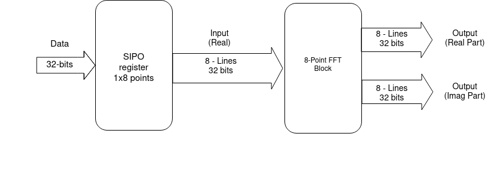

# Realizing 8-point Fourier Transform
### Sixth Stage
As we know, in practice we can obtain only one sample at a time, we make use of a shift register kindoff block, that takes in only a single point 32-bit data, and stores it, whenever a new data sample is obtained, every point shifts their position and given to FFT block to do the calculation. The whole system now only a single point one after the other and provides output of 32-bit 8 points, real and imaginary each. The block diagram of the system is shown below.  
 

### Fifth Stage
The Butterfly was rearranged and connected back again, as shown in the diagram below 
 
The latest version seems to be working fine, there was an issue with multiplication of Twiddle factor, that, everytime we mulitply them, every element need to be multiplied with the respective value of unity too, else, there would be a mismatch in the factor of scaling.

### Fourth Stage
The arrangements and connections in previous stages were not working quite well, hence they were restructured to get somewhat working one. The negative values are still in 2's complimented form only. Finding a way to display them in proper format without altering much of the core structure. There are a little confusions in the **hexvalues of sine and cosine** which will be used in Twiddle factor calculations, hopefully they will get resolved soon

### Third Stage
The issue with the floating points was resolved. Every values in the system were mulitplied by a factor, here 100, to help eliminating the floating points, instead, the final input is now scaled to 100x and so is the output. The components of the twiddle factor, cos() and sin(), are evaluated by using the values stored in the **.data** files and this can be used to calculate twiddle factor.

### Second Stage
Tried to do it in Verilog only, I could implement it successfully, but the problem arised when I had to inculcate the floating points of the W(8), hence I have put some random values now, just demonstrate the working status. Looking forward to get better!

### First Stage
This is a System Verilog code, to compute Fourier Transform (here, It was 4-point only)
I could successfully run the simulation using SYNOPSYS VCS available commercially at EDA Playground.

Note: I had actually tried to use Verilog for this, but then it kept showing me that the ports declared needed to be packed and started giving me errors which doesn't seem to get resolved, which I ultimately got resorted to use SystemVerilog to do the same.
